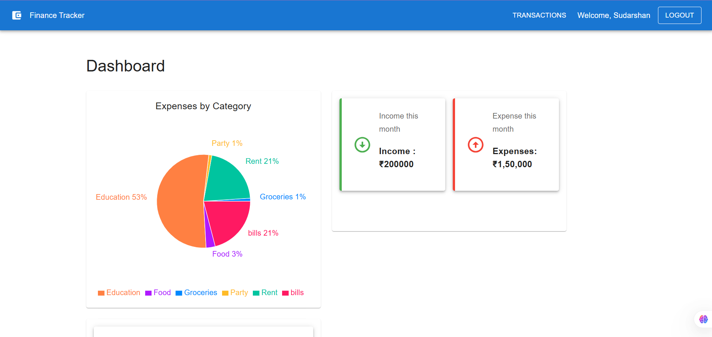
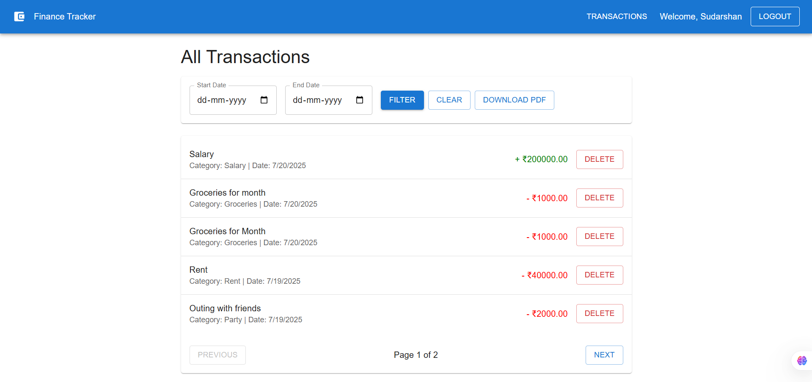

# 💰 Finance Assistant

<!-- 

 -->

A full‑stack personal finance manager where users can securely log in, track income & expenses, upload receipts, visualize data with charts, and download their transaction history in PDF format.

---

## 📽️ Demo Video Link


https://www.loom.com/share/5f333c35ccaa4f469f70c18f906aa6f9?sid=8ab32888-171d-4509-aea0-aa668c4c9d08

---

## 📸 Screenshots

| Dashboard Page | Transaction Page|
|----------------|-----------------|
|  |  |

---

## ✨ Features

- 🔐 **Authentication** (User Authentication with JWT and Cookies)  
- 💸 **Track income & expenses**  
- 🧾 **Upload and scan receipts** (Multer and Gemini API)  
- 📈 **Data visualization** (Bar/Pie charts)  
- 📆 **Filter transactions** by date range  
- 📄 **Download transaction history as PDF**  
- 📱 **Responsive UI** built with Material UI

---

## 🛠 Tech Stack

| Layer     | Tech                                                          |
|-----------|---------------------------------------------------------------|
| Frontend  | React (Vite), Material UI , Recharts, Axios        |
| Backend   | Node.js, Express, JWT, Multer, Gemini API for reading content of receipt             |
| Database  | MongoDB Atlas, Mongoose                                       |
| Utilities | jsPDF & jspdf‑autotable (PDF export)                          |

---

## 📂 Project Structure

```text
/client          → Vite React frontend
/server          → Express backend
  ├─ routes      → API routes
  ├─ controllers → Logic handlers
  └─ models      → Mongoose models  
```

---

## ⚙️ Local Setup

### 1. Clone the repo

```bash
git clone https://github.com/sudarshan4718/Finance_Assistant.git
```
### 2. Add .env file in server

```bash
MONGO_URI   (Mongo DB atlas url)
PORT = 6000
JWT_SECRET
NODE_ENV
GEMINI_API_KEY 
```

### 3. Install & run backend

```bash
cd server
npm install
npm run server
```

### 4. Install & run frontend

```bash
cd  ./client
npm install
npm run dev
```

Visit **http://localhost:5173**

---

## 🧪 PDF Download Test

1. Navigate to **Transactions** page.  
2. (Optional) apply a date filter.  
3. Click **Download PDF** – a file named `transactions_report.pdf` will download to your browser’s default *Downloads* folder.

---

## 📄 API Quick Reference

| Method | Endpoint                               | Description                                  |
|--------|----------------------------------------|----------------------------------------------|
| POST   | `/api/user/register`                   | Register new user                            |
| POST   | `/api/user/login`                      | Login & receive JWT                          |
| POST   | `/api/user/logout`                     | Logout User                                  |
| GET    | `/api/user/get-details`                | get logged in user details                   |
| GET    | `/api/user/is-Authenticated`           | Checks if user is authenticated using cookies|             
| GET    | `/api/transaction/get-transactions`    | List all transactions                        |
| POST   | `/api/transaction/add-transaction`     | Add a new transaction                        |
| POST   | `/api/transaction/scan-receipt`        | Upload receipt & extract data                |
| DELETE | `/api/transaction/delete-transaction/:id`| Delete a transaction by its particular id  |

---

## 🧑‍💻 Author

**Sudarshan Jha**  
GitHub: <https://github.com/sudarshan4718>

---

